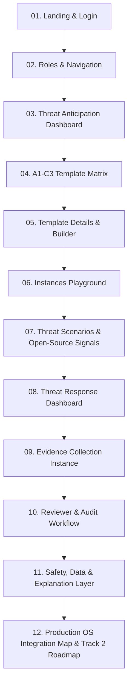

# INSTANCES: Open-Source Customizable Trust & Defence Platform
## Action Plan & Master AI Execution Prompt
**Event:** Open Source Hackathon 2026 (UniPod · OSCB · Orange Digital Center · University of Botswana)  
**Track:** 01 — Defence & Security  
**Target Environments:** Antigravity (Windows CMD / PowerShell) & Replit (Yarn-based)

---

## 1. Executive Summary & Vision

### Problem
Organizations, schools, clinics, and individuals in Botswana lack a dedicated, customizable, and accessible cybersecurity platform. Commercial zero-trust solutions (such as ThreatLocker) are prohibitively expensive, complex, proprietary, and require high-overhead IT departments. Meanwhile, open-source security tools (AppArmor, Linux IMA, OpenSnitch, Wazuh, OSQuery, Suricata, Velociraptor, Trivy, ZAP) are fragmented and alienating to non-technical operators.

### Solution: INSTANCES
**INSTANCES** is a customizable trust and security platform that combines open-source security signals with:
1. **Protection Profiles & $A_1-C_3$ Matrix:** Tailoring zero-trust enforcement to organizational size (1–3: Individual to Large Network) and data sensitivity (A–C: Personal Files to Critical Medical/Health Records).
2. **Threat Anticipation & Simulation Playground:** Emulating ThreatLocker-grade controls (Allow-Listing, Ringfencing, Elevation Control, Storage & Network boundaries) powered conceptually by open-source engines without live root exploits.
3. **Plain-Language Explanations:** Translating low-level telemetry into actionable, calm human advisories.
4. **Threat Response & Evidence Collection Workflows:** When incidents occur, users receive a non-invasive, structured evidence collection checklist instead of handing over full remote desktop control to an IT contractor.
5. **Auditable Reviewer Actions:** Transparent timelines for triage, verification, and resolution.

---

## 2. Tech Stack & Execution Constraints

To guarantee 100% portability between **Windows Command Prompt (Antigravity)** and **Replit**, the MVP is designed as a zero-friction, highly stylized Single Page Web Application (SPA):

- **Package Manager:** `yarn` (preferred over npm)
- **Framework:** React 18 / Vite / TypeScript
- **Styling:** Tailwind CSS (Dark-mode, cyber-defense aesthetic: slate/zinc backgrounds, emerald-500 trust accents, cyan-500 telemetry glows, amber/rose alert states)
- **Icons:** `lucide-react`
- **State & Architecture:** Client-side deterministic state engine with rich pre-seeded mock datasets, local storage persistence, and one-click reset. No external database or root OS daemon required for the 6-hour hackathon build.

---

## 3. The 12-Module Controlled Build Sequence



### Module 01: Landing & Login
- **Visuals:** High-tech, clean landing page introducing INSTANCES. Hero header highlighting *"Zero-Trust Security Scaled for Botswana"*.
- **Explainer Cards:** Plain-language comparison between **Threat Anticipation** (proactive ringfencing) and **Threat Response** (incident evidence packaging).
- **Authentication:** Demo sign-in with quick role selection buttons:
  - *Enter as Defender / Anticipation Lead*
  - *Enter as Incident Responder / Reviewer*
  - *Admin Portal (Pre-seeded: `admin@instances.bw` / `security2026`)*

### Module 02: Roles & Navigation
- **Workspace Isolation:**
  - **Anticipation Workspace:** Focuses on devices, matrix profiles, template builder, and live simulation playground.
  - **Response Workspace:** Focuses on open evidence tickets, collection checklists, and reviewer resolution timeline.
  - **Admin Workspace:** System telemetry, mock agent health, community template repository approvals, and event logs.
- Clean sidebar navigation with role badge and quick workspace switcher for hackathon judges.

### Module 03: Threat Anticipation Dashboard
- **Calm Security Center:** Avoids intimidating alarm walls; displays an active Protection Score, Protected Assets summary (e.g. 14 Workstations, 2 Primary Health Care Servers), and quick actions.
- **Onboarding Guide:** 3-step interactive card: *Select Matrix Tier → Simulate Threat in Playground → Deploy Synthetic Policy*.
- **Quick Metrics:** Blocked unauthorized binaries (past 24h), Storage ringfence status, Network anomaly alerts.

### Module 04: $A_1 - C_3$ Template Matrix
A 3x3 interactive matrix mapping environment size to data sensitivity:
- **Rows (Size/Scale):**
  - `1`: Individual / Freelancer / Micro (1–5 devices)
  - `2`: School / Small Business (5–50 devices)
  - `3`: Hospital / Clinic / District Network (50+ devices)
- **Columns (Data Sensitivity):**
  - `A`: Standard / Low Risk (Public documents, media, casual browsing)
  - `B`: Sensitive Business (Financial spreadsheets, student records, HR data)
  - `C`: Critical / Regulated (Patient Electronic Health Records, national ID data)
- **Pre-seeded Archetypes:**
  - **A1:** Solo Developer / Creative
  - **B2:** Gaborone Secondary School Computer Lab
  - **C3:** Village Health Clinic (Kanye / Mochudi Primary Health Clinic) — *Highlighted as the primary demo case*.

### Module 05: Template Details & Builder
- **Profile Inspector:** Inspects ringfencing parameters:
  - Allowed applications (e.g. `dhis2-client`, `libreoffice`, `browser-safe`)
  - Storage controls (USB storage blocked or read-only)
  - Network rules (Block outbound unknown IPs, restrict database port `5432` to local subnet)
- **Developer Template Builder:** Interactive form with live JSON schema preview, validation, and ability to save/star templates into "My Templates".

### Module 06: Instances Playground
- **Interactive Sandbox:** One-click simulation environment to test policies without altering real computers.
- **Action:** Select a target profile (e.g. `C3 Clinic Protection`) and choose a scenario:
  - *Scenario A: Ransomware executable attempting to encrypt `/var/data/records`*
  - *Scenario B: Unapproved USB drive inserted containing script*
  - *Scenario C: Outbound exfiltration attempt over port 4444*
- **Outcome Card:**
  - Instant **ALLOW** or **BLOCK** decision badge.
  - Plain-English breakdown ("Why this was blocked in simple terms").
  - Technical telemetry panel showing conceptual open-source rule matches.

### Module 07: Threat Scenarios & Open-Source Signal Mapping
Explicit educational mapping to open-source software:
| Capability | Open-Source Engine | Role in Instances |
| :--- | :--- | :--- |
| **Application Allow-listing** | Linux IMA / AppArmor / Windows AppLocker | Cryptographic hash enforcement of permitted binaries |
| **Ringfencing & Elevation** | SELinux / Polkit / sudoers | Restricting allowed binaries from invoking child processes |
| **Network Boundary** | Suricata / OpenSnitch / nftables | Monitoring and terminating unexpected socket connections |
| **Host Telemetry & Audit** | Wazuh / osquery / Velociraptor | Real-time endpoint query and file integrity monitoring |
| **Vulnerability Scanning** | Trivy / OWASP ZAP | Continuous pre-execution artifact scanning |

### Module 08: Threat Response Dashboard
- Non-technical, reassuring UI when an anomaly or incident occurs.
- Active Tickets & Requests:
  - Ticket `#IR-8092`: Suspicious patient database export at Clinic Computer #3.
  - Urgency Badge: `HIGH`, Status: `Action Required by Clinic Staff`.
- Prominent button: **"Open Guided Evidence Checklist"**.

### Module 09: Evidence Collection Instance (Bounded Checklist)
- Eliminates the security risk of unvetted IT contractors demanding unrestricted remote desktop (AnyDesk/TeamViewer).
- Guided step-by-step collection:
  1. *Step 1: Event Context* (Timestamp, local workstation ID).
  2. *Step 2: Requested Log Capture* (One-click synthetic export of local audit logs).
  3. *Step 3: Screenshot / Note Submission* (Staff attaches photo of suspicious pop-up or invoice).
  4. *Step 4: Package & Encrypt* (Generates a sealed, hashed evidence bundle).
- Submit directly to Reviewer queue.

### Module 10: Reviewer & Audit Workflow
- Dedicated IT Reviewer View:
  - Triage actions: `Request More Details`, `Validate & Quarantine`, `Resolve & Update Policy`.
  - Reviewer notes panel with audit stamps.
  - Immutable timeline displaying who uploaded evidence, when the reviewer opened it, and the final remediation action.

### Module 11: Safety, Data, and Explanation Layer
- **Demo Mode Banner:** Displays permanent badge *"DEMO MODE: Synthetic Telemetry Active (Safe for Live Presentation)"*.
- **One-Click Reset:** Button in footer/header to reset local storage back to pristine demo state.
- Dual Explanation System: Every blocked event offers a toggle:
  - *View Plain Language* (For clinic managers / headmasters)
  - *View Technical Telemetry* (For security engineers / judges)

### Module 12: Production OS Integration Map & Track 2 Roadmap
- **Track 1 (Today):** The browser-based zero-trust orchestration and bounded evidence interface.
- **Track 2 (Production Road):**
  - Windows: Native WDAC (Windows Defender Application Control) and Event Log Forwarding via native service.
  - Linux: Linux Kernel IMA/EVM, AppArmor profiles, and eBPF network hooks.
  - Botswana Open Source Community Hub: A public repository where developers can publish and upvote verified protection templates for local businesses.

---

## 4. Master 3-Minute Hackathon Presentation Script (The Golden Demo)

| Time | Screen | Action & Talk Track |
| :--- | :--- | :--- |
| **0:00 - 0:45** | **Landing / Login** | Introduce the problem: Clinics & schools in Botswana cannot afford enterprise zero-trust tools like ThreatLocker. Introduce **INSTANCES** as the open-source, human-centric trust platform. Click *Demo Login as Clinic Administrator*. |
| **0:45 - 1:30** | **Matrix & Profile** | Show the **$A_1-C_3$ Matrix**. Select **C3 (Clinic / Critical Patient Records)**. Point out how it translates open-source tools (AppArmor, Wazuh, Suricata) into zero-trust rules without needing an enterprise console. |
| **1:30 - 2:15** | **Playground Simulation** | Jump to **Instances Playground**. Run the "Unauthorized USB Patient Record Exfiltration" attack. Show the immediate **BLOCKED** state with plain-English explanation: *"Application 'unknown_updater.exe' was blocked from reading health records because it is not on the C3 allow-list."* |
| **2:15 - 2:45** | **Response & Evidence** | Switch to **Threat Response**. Show that instead of giving remote control to a stranger, the clinic nurse is guided through a **Bounded Evidence Checklist**. Submit the synthetic bundle. |
| **2:45 - 3:00** | **Reviewer Audit & Track 2** | Open Reviewer view: demonstrate the transparent audit trail and show the **Track 2 OS Architecture Map** for native Windows/Linux integration in Botswana. |

---

## 5. Ready-to-Execute AI Coding Prompt

*(Copy and paste the exact prompt block below into Antigravity or Replit to generate the full project).*

```markdown
You are an expert full-stack TypeScript engineer building "INSTANCES" for Track 01 (Defence & Security) at the Open Source Hackathon 2026 Botswana.

Build a complete, polished, interactive single-page application in React + Vite + Tailwind CSS + Lucide Icons.
The app must run cleanly with `yarn install` and `yarn dev`.

### CORE REQUIREMENTS:
1. DESIGN & FEEL:
   - Modern, sleek cybersecurity console. Deep dark palette (`bg-slate-950`, `bg-slate-900`, `border-slate-800`), crisp typography, emerald trust accents (`emerald-400`), cyan telemetry glows, and amber/rose alert states.
   - Clean top navigation bar with: Instances Logo ("INSTANCES // Trust Platform"), Role Switcher (Anticipation / Response / Admin), Demo Reset Button, and "Botswana Hackathon 2026 Edition" badge.

2. MODULE 01: LANDING & LOGIN
   - Hero explaining: "Customizable Zero-Trust Security for Botswana".
   - Cards explaining the dual pillars: Threat Anticipation (Zero-trust policy matrix) vs. Threat Response (Bounded evidence collection).
   - One-click quick login buttons:
     * "Sign in as Defender (Threat Anticipation)"
     * "Sign in as Incident Responder (Threat Response)"
     * "Enter Admin Console" (or via credentials `admin@instances.bw` / `security2026`)

3. MODULE 02-05: THREAT ANTICIPATION & A1-C3 MATRIX
   - Interactive 3x3 Template Matrix:
     * Rows: 1 (Individual 1-5 devices), 2 (School/SME 5-50 devices), 3 (Clinic/Enterprise 50+ devices)
     * Columns: A (Standard data), B (Business/Academic records), C (Critical Medical/National ID records)
     * Highlighted seed: C3 (Rural Clinic Health Record Protection)
   - Template Inspector modal/drawer: shows allowed binaries, storage rules (USB ringfence), network rules (Suricata port blocking), and live JSON view.
   - Template Builder drawer: allows creating a custom template with JSON preview and "Save to My Templates".

4. MODULE 06-07: INSTANCES PLAYGROUND & OPEN SOURCE SIGNALS
   - Interactive simulation panel:
     * Choose Profile (e.g. C3 Clinic)
     * Choose Attack Scenario:
       1. "Ransomware Binary Execution (Wazuh/IMA match)"
       2. "Unauthorized USB Medical File Read (Storage Ringfence)"
       3. "Port 4444 Outbound Exfiltration (Suricata network rule)"
       4. "Approved DHIS2 Clinic Record Update (Legitimate Action)"
     * Click "Run Simulation":
       - Shows instant Allow/Block badge.
       - Shows Plain-English explanation ("Why this was blocked in simple terms for clinic staff").
       - Shows Technical telemetry tabs (Simulated Suricata alert / AppArmor denial / Wazuh rule ID).
       - Button: "Escalate to Threat Response Case".

5. MODULE 08-10: THREAT RESPONSE & BOUNDED EVIDENCE COLLECTION
   - Threat Response dashboard with active incidents (e.g., `#INC-4021: Suspicious Access at Mochudi Clinic`).
   - "Start Evidence Collection" wizard:
     * Step 1: Incident details & device verification.
     * Step 2: Diagnostic log pull (synthetic system log generation).
     * Step 3: Staff notes and simulated screenshot upload.
     * Step 4: Encrypted submission package generation with SHA-256 hash.
   - Reviewer Portal:
     * Review submitted evidence packages.
     * Add reviewer analysis notes.
     * Update status: `Under Review` -> `Policy Remediated` -> `Resolved`.
     * Full tamper-evident audit timeline.

6. MODULE 11-12: SAFETY & PRODUCTION OS INTEGRATION MAP
   - Permanent "Demo Mode - Synthetic Telemetry" indicator with 1-click state reset.
   - "Architecture & OS Roadmap" tab:
     * Interactive documentation showing how each feature translates to real-world production OS controls:
       - Windows: AppLocker / WDAC & Event Forwarding
       - Linux: AppArmor, IMA/EVM, auditd
       - Network: Suricata & OpenSnitch
       - Community Hub: Botswana Open Source template sharing system.

Ensure the application is 100% self-contained, responsive, beautifully styled, has zero broken buttons, and can be navigated effortlessly during a live hackathon pitch!
```

---

## 6. Local Quickstart Commands (Windows Command Prompt & Replit)

```cmd
:: 1. Initialize project with Vite & React + TypeScript
yarn create vite instances-app --template react-ts

:: 2. Navigate to project directory
cd instances-app

:: 3. Install Lucide icons & Tailwind CSS
yarn add lucide-react
yarn add -D tailwindcss postcss autoprefixer
yarn tailwindcss init -p

:: 4. Launch development server
yarn dev
```
